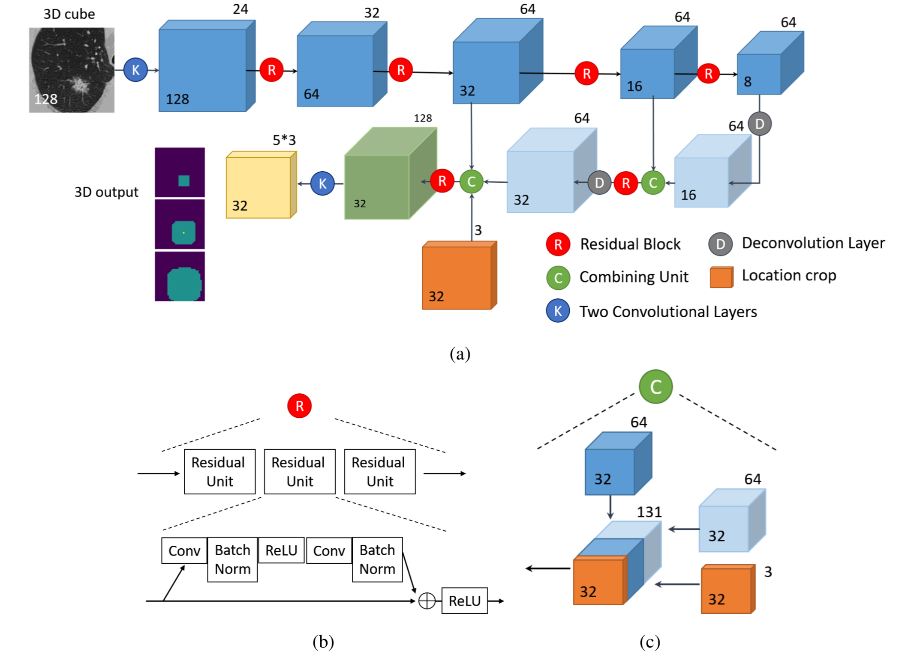

# LUNA16 object detection
Developing a well-documented repository for the Lung Nodule Detection task on the Luna16 dataset. This work is inspired by the ideas of the first-placed team at [DSB2017](https://www.kaggle.com/c/data-science-bowl-2017), "[grt123](https://github.com/lfz/DSB2017)".

Lung cancer is the most common cancer in the world. More people die as a result of lung cancer each year than from breast, colorectal, and prostate cancer combined.
Lung nodule detection is an important process in detecting lung cancer. Lots of work has been done in providing a robust model, however, there isn't an exact solution by now. 

The [Data Science Bowl](https://datasciencebowl.com) (or DSB in short) is the world's premier data science for social good competition, created in 2014 and presented by Booz Allen Hamilton and Kaggle. The Data Science Bowl brings together data scientists, technologists, and domain experts across industries to take on the world's challenges with data and technology.
In DSB2017, the competition was held to find lung nodules. Team grt123 came up with [the best results](https://www.kaggle.com/c/data-science-bowl-2017/leaderboard) by implementing a 3d UNet based YOLO. At this repository, I'm going to attack the problem inspired by their approach and provide a better result in some cases. Furthermore, I'm going to make it well documented to enrich the literature.

Making their implementation working on every GPU configurations (even no GPU!), changing the data pre-processing, and augmentation from a big monotonic code into two stages are my first goals.
Mainly I have gone through [their paper](https://arxiv.org/abs/1711.08324).
I hope it helps researchers. If you have any questions on the code, please send an [email to me](mailto:s.mostafa.a96@gmail.com?subject=[GitHub]%20LUNA16%20grt123).

# Code description
## Prepare
The preparation code is implemented in the `prepare` package, including pre-processing and augmentation.

### Tutorials:
There is a [jupyter notebook as a tutorial](./notebooks/Preprocessor.ipynb), covering the pre-processing steps. 
Take a look at the `prepare._ct_scan.CTScan.preprocess` method. 
Also, there is another [jupyter notebook tutorial](./notebooks/Augmentor.ipynb) explaining the augmentation techniques of the method `prepare._ct_scan.CTScan.get_augmented_subimage`, 
which is strongly recommended to review.

## Model
In order to have a good image of the "Nodule Net", you could study [the paper]!
The below image shows the network structure. 
Its code is in model package mostly the same as the original version of the code.
Also, loss computation at `model/loss.py` is an IOU approach, to know the details you can read their paper.

## Main
The `LunaDataSet` class in `main/dataset.py`, loads the saved augmented data to a torch `Dataset` and uses it to form a `DataLoader` and then feed the model as well as computing the loss.

# How to use
1. Download the Luna16 dataset from [here](http://academictorrents.com/collection/luna-lung-nodule-analysis-16---isbi-2016-challenge).
**There is also a small version of the dataset just for testing which is available in my google drive [here](https://drive.google.com/file/d/1QOSRnUiwp08AFYOFgrCWJrEEEckZG1_0/view?usp=sharing), it is because the size of the original dataset is too large to download.**
Also, for more information, the dataset description is available [here](https://luna16.grand-challenge.org/data/).
2. Change the first 3 variables in `configs.py` file

3. Run `prepare/run.py`

4. Run `main/train.py`

### Using google colab
The model has been trained in some small epochs by a [small sample](https://drive.google.com/file/d/1QOSRnUiwp08AFYOFgrCWJrEEEckZG1_0/view?usp=sharing) on google colab infrastructure.
You could simply copy the data to your own Google Drive account and run it to learn the procedure of training the model using google colab!
