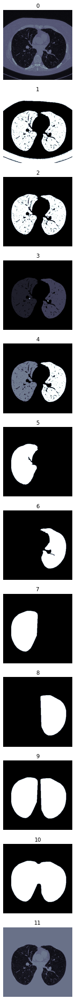

# Luna16 object detection
Trying to develop a readable documented repository for Lung Nodule Detection. (Based on the approach of team "[grt123](https://github.com/lfz/DSB2017)" which stood on the first place of DSB2017)

Basically, I am going through [their paper](https://arxiv.org/abs/1711.08324), hence their code (except for their model) was not readable to me at all.

I hope it helps researchers.
If you have any questions on the code, please send an [email to me](mailto:s.mostafa.a96@gmail.com?subject=[GitHub]%20LUNA16%20grt123).
# Till now
Preprocess steps:

The image bellow shows how these steps can be done.

* Convert the original 3d image into a binary image. (image: 1)
* Remove the blobs connected to the border of the image. (image: 2)
* Label the connected points of the image. (image: 3)
* Keep the labels with 2 largest areas and segment two lungs. (image: 4)
* Fill in the small holes inside the mask of lungs which we seperate right and left lung. r and l are symbolic and they can be actually left and right! (images: 5, 6)
* Fill convex hull of each lung. (images: 7, 8)
* Joint two separated right and left lungs. (image: 9)
* Closure operation with a disk of radius 10. This operation is to keep nodules attached to the lung wall. (image: 10)
* Superimpose the binary mask on the input image. (image: 11)

And data augmentations steps:

* Scaling the 3d image with a scale factor between 0.75 and 1.25 (their scale factor is between 0.8 and 1.15, I changed it for simplicity)
* Random Cropping the 3d image which contains nodule in it. All details are the same as their paper.
* 90 degrees rotation, based on different axes and flipping (A cube can have 24 different types of rotate and flip actions). All details are the same as their paper.

This is a part of their paper which is related to data augmentation:

`
To overcome [the problem of being hard to work with 3d images], small 3D patches are extracted from the lung scans and input to the network individually. The size of the patch is 128×128×128×1 (Height×Length× Width×Channel, the same notation is used in what follows). Two kinds of patches are randomly selected. First, 70% of the inputs are selected so that they contain at least one nodule. Second, 30% of the inputs are cropped randomly from lung scans and may not contain any nodules. The latter kind of inputs ensures the coverage of enough negative samples.
If a patch goes beyond the range of lung scans, it is padded with value 170, same as in the preprocessing step. The nodule targets are not necessarily located at the center of the patch but had a margin larger than 12 pixels from the boundary of the patch (except for a few nodules that are too large).
Data augmentation is used to alleviate the over-fitting prob- lem. The patches are randomly left-right flipped and resized with a ratio between 0.8 and 1.15. `